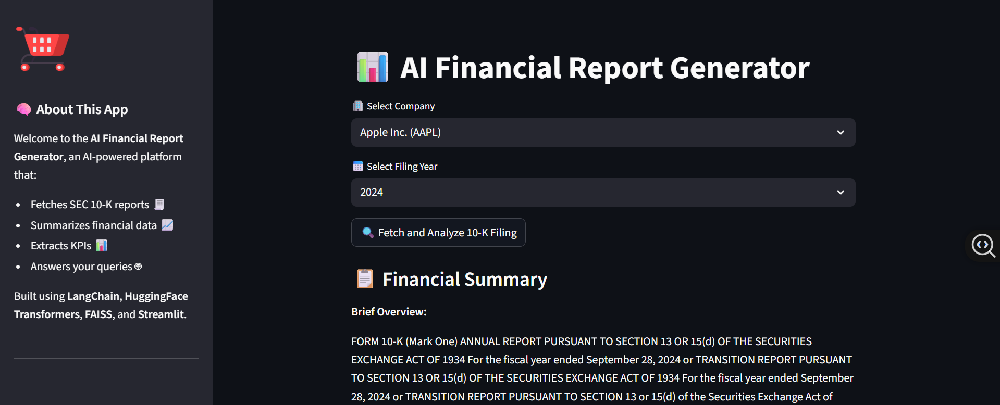
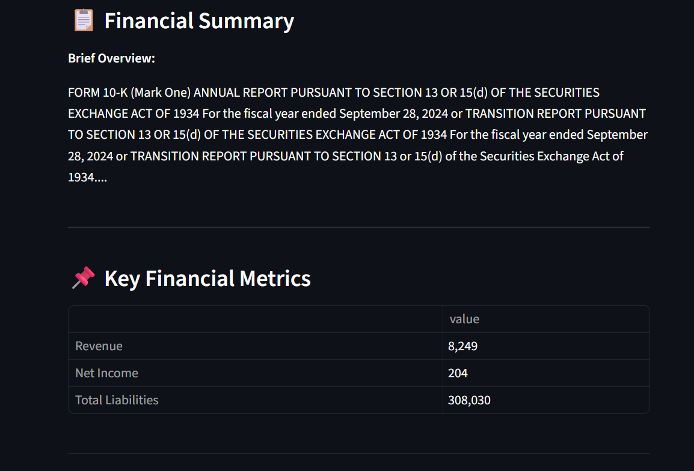
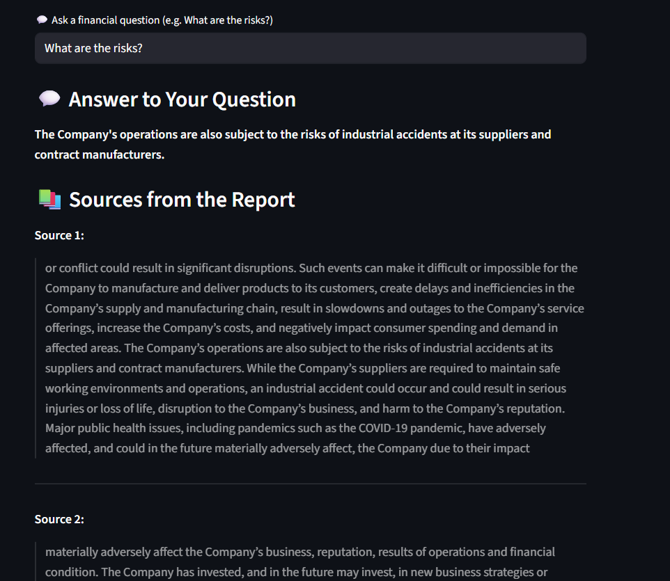
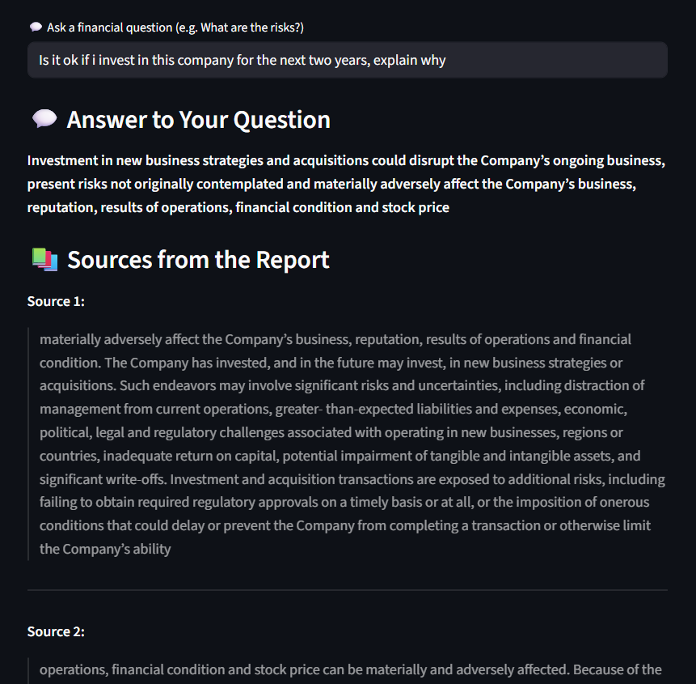

# 📊 AI Financial Report Generator

An AI-powered web app that fetches, analyzes, and summarizes financial reports (10-K SEC filings) of top companies like Apple, Microsoft, and Tesla. The app extracts key financial metrics, generates executive summaries, and answers user questions using LLMs — all without needing an OpenAI key.


## 🚀 Features

- ✅ **Fetch 10-K Reports** from [SEC EDGAR](https://www.sec.gov/edgar)
- 🧠 **Summarize Reports** using Transformer models (T5, FLAN-T5)
- 📊 **Extract Key Financial Metrics** like Revenue, Net Income, Liabilities
- 💬 **Ask Questions** about the company’s risks, strategy, or finances
- 📄 **Download** AI-generated financial summaries as professional PDFs
- ☁️ **Deployed on Google Cloud Platform (GCP)** using Streamlit

---

## 🛠️ Tech Stack

| Module        | Tool/Library                      |
|---------------|-----------------------------------|
| Frontend      | Streamlit                         |
| NLP/AI Models | HuggingFace Transformers (FLAN-T5)|
| RAG           | LangChain                         |
| Embeddings    | SentenceTransformers + FAISS      |
| PDF Parsing   | PyMuPDF (`fitz`)                  |
| PDF Reports   | ReportLab                         |
| Data Source   | SEC EDGAR (CIK → 10-K PDF)        |
| Deployment    | GCP App Engine / Streamlit Cloud  |

---

## 📷 Demo

1. **Select Company & Year**
2. **Fetch SEC 10-K Filing**
3. **Analyze Financials**
4. **Ask Questions**
5. **Download PDF Summary**

 

---

 

---

 

---



---

## ⚙️ Setup Instructions

```bash
# Clone the repo
git clone https://github.com/nagakoushik24/AI-Financial-Report-Generator-and-Analyzer.git
cd ai-financial-report-generator

# Create a virtual environment
python -m venv venv
source venv/bin/activate  # On Windows: venv\Scripts\activate

# Install dependencies
pip install -r requirements.txt

# Run Streamlit app
streamlit run app.py
```

## 📂 Project Structure

```

├── app.py                       # Main Streamlit app
├── pdf_utils.py                # PDF reading + chunking
├── vector_store.py             # FAISS indexing + embedding
├── summarizer.py               # Summarization with Transformers
├── rag_pipeline.py             # RAG chain (LangChain)
├── kpi_extractor.py            # Regex/heuristics for KPI metrics
├── sec_utils.py                # Fetch SEC 10-K from EDGAR
├── pdf_download.py             # PDF generator with ReportLab
├── requirements.txt
├── README.md
```

## 📁 Sample PDF Output

AI-generated report includes:

- Executive summary
- Extracted KPIs
- Q&A response
- Source highlights from the 10-K
-  

## 🌐 Deployment (GCP)

- Deployed on Google Cloud Platform (GCP) using:
- Google Cloud App Engine
- GCS for file storage (if needed)
- Streamlit public instance for UI

## ✅ Applications

- Summarizes SEC 10-K filings into digestible text for investors, analysts, and researchers.
- Allows users to ask financial questions (e.g. risks, revenue, liabilities) and receive contextual answers from the report.
- Automatically extracts key performance indicators like Revenue, Net Income, and Liabilities.
- Assists students and learners in understanding complex financial reports with AI-generated summaries.

## 🚀 Future Work

- Enable users to compare company KPIs across different years for trend analysis.
- Extend to filings like 8-K, 20-F, S-1, and quarterly 10-Qs beyond just 10-K reports.
- Integrate logos, profiles, and stock performance using APIs (e.g., Clearbit, Yahoo Finance).
- Package the app with Docker, and deploy to cloud platforms like GCP or Streamlit Cloud for scalability.

